# MIDI TO FNF CHART GENERATOR

A program and possibly extensible Python module that converts MIDI files set up in a specific way into FNF Psych engine
0.7 charts.

"Hey where's the executable" GO TO THE RELEASES TAB THERE ARE EXECUTABLES - for you desktop users, just
CTRL+F `releases`.

What do we support?

- Events, from notes and can have values vary based on pitch and channel (note color)
- Notes

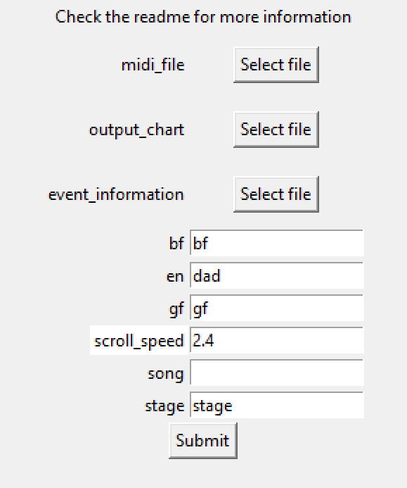

## Overview

Here's how to use this program from the UI.
If you want more customization, or you don't
trust random executable files, scroll down
to the bottom of this page.

### MIDI Constraints

**Your MIDI / FL Studio project must adhere to this otherwise the program will NOT accept your audio file:**

#### BPM CHANGES

BPM changes must be instant **(be a snap)** and can only be positioned at the end of each bar (also accounting for time
signature changes). The program will reject MIDI files that violate this.

#### TIME SIGNATURE CHANGES

**NOTE: Time signature markers currently do not export in FL Studio if put in the playlist. They will only save by saving the piano roll. I need to figure out a workaround...**

There is a proper way to handle time signatures... but we have some rules
with the MIDI. Time signature changes are handled by time signature change markers in FL Studio.

1. The denominator for all time signatures **must** be 4. The program will refuse MIDIs if anywhere has its time
   signature be any value but 4. Always round down to 4/4. This means:

- `6/8 -> 4/4` (For sheet music, that would be equivalent to cramming triplets)
- `7/8 -> 3.5/4`; in this case you need an 8/4 marker once every 7 beats
- `2/2 -> 4/4`
- `13/8 -> 6.5/4`; in this case you need a 7/4 marker once every 6.5 beats
- Unless you are Kreagato you do not need to worry about this, ever

2. You may place time signature markers anywhere you like.
3. If a marker is not placed at the start of where a bar should be (e.g. song starts off at 4/4, marker placed at beat
   7), the last "partial bar" before the time signature change will be cut off. In the previous example, it would be
   treated as 4/4 at beat 0, 3/4 at beat 4, 4/4 at beat 7. Note that I count from 0, FL Studio counts from 1. As stated
   before, **this is the only way to achieve decimal time signature changes.**

### Structure of a MIDI file

MIDI files have

- Many Tracks, each of which store
  - Notes
  - Its track name

Where each note stores:

- It's pitch
- When it is played
- How long it is played for
- How loud it is (velocity)
- Its channel, which corresponds to that one slider in MIDI out, **or** the color of the note in FL Studio's piano roll

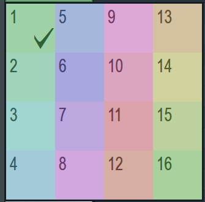

> [!WARNING]
> FL Studio numbers channels from 1 to 16 inclusive, but this program counts channels from 0, so you will have to subtract FL Studio's channel numbers by 1 when you are referencing them in the context
of this program.

**REMEMBER TO ENABLE THIS FOR __EACH__ MIDI OUT**

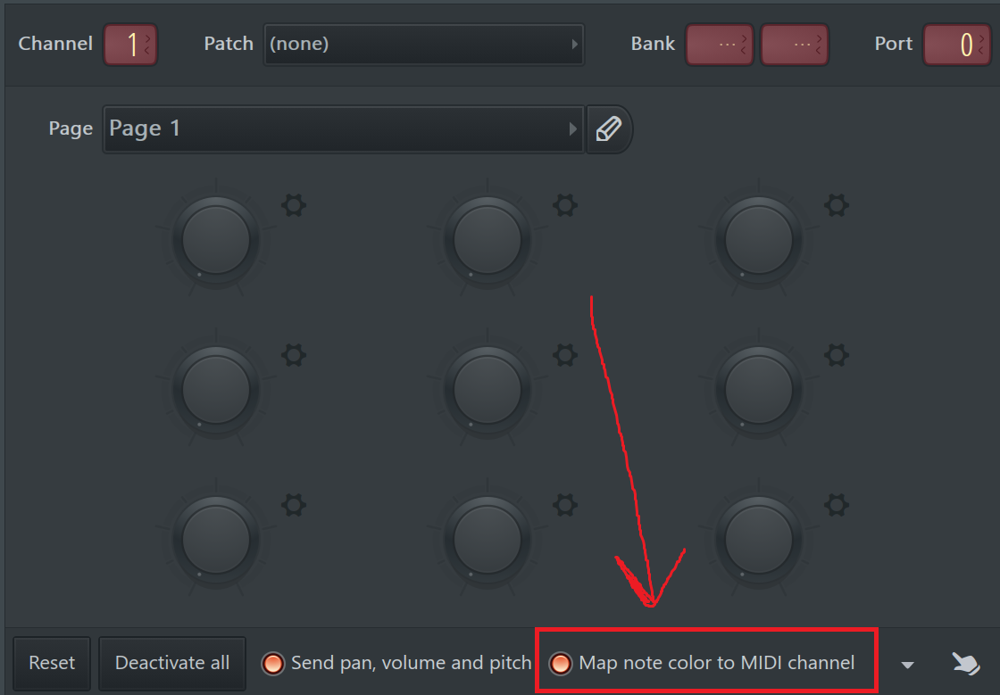

This means the valid channels are `0, 1, 2, 3, 4, 5, 6, 7, 8, 9, 10, 11, 12, 13, 14, 15`. Good luck
subtracting everything by 1 all the time.


In FL Studio, you export MIDI files by creating
MIDI out tracks then exporting as MIDI.

You make a MIDI track by making a MIDI out instance in the channel rack.

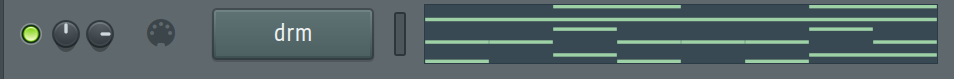

This track is named `drm`. You set the track name by naming the MIDI out.

Now when you export this project as a MIDI,
it exports a MIDI with a track named `drm`, and
all the notes associated with it in that track.

### Running the converter

Run the executable you've downloaded in the releases tab (or in Python, `run_with_ui.py`). Input all metadata, path to the input MIDI, and path to
the output chart file which is a JSON there.

This assumes your "MIDI" is configured as the following:

- There is a track named `en` with the following notes:
  - All `C5` notes being the enemy's left notes
  - All `C#5` notes being the enemy's down notes
  - All `D5` notes being the enemy's up notes
  - All `D#5` notes being the enemy's right notes
  - Notes will be made sustain notes if they are long enough, based on the note's duration. If you want to force a note
    to be a sustain note anyway, just set its velocity to be below half of its maximum
- There is a track named `bf`, structured in a similar way to how `en` is structured
- There is a track named `cam`. On the **start** of each "bar" (section), put any note `C5` or lower if you want the
  camera to move to the enemy, put any note `C#5` or higher if you want the camera to point to `bf`, or no note if you
  want the camera to stay where it is. If you decide to put a note that does not start right on a section (bar), the
  program just searches for the first note that **begins** in that section. The note duration does not matter here
  otherwise.

### Configuring Events

Event UI recap (in the image below, `Hey!` is the name of the event, exactly):

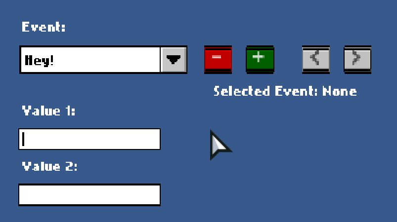

You may select an event configuration JSON
file.

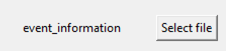

Here's how placing events in the chart
from the MIDI works:

- You make a track, maybe with the name of `bops`
- You would put notes there, where the time of that note is when you want the screen to bop.

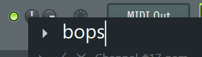

Okay. That is the idea, but how do you tell the program how you want to convert certain notes in tracks into events? You
put all the information in the event configuration JSON.

If you've tried looking or modifying FNF chart
files directly, you might be familiar with how
JSON files work. If you have no idea how
they work, [check this](https://www.w3schools.com/js/js_json_intro.asp).

Here is the JSON structure, taking note that **this is a list** and is thus wrapped in `[square brackets]`:

```js
[
  {
    // ONLY take notes from this track name
    // which is the name of the channel
    // rack instance from FL Studio
    // aka you should rename that one MIDI Out
    // to this for your target track
    "track_name": "bops",
    
    // Name of the event as it appears
    // in the psych chart editor
    "event_name": "Add Camera Zoom",
    
    // value 1 that appears 
    // in the chart editor
    "v1": "0.015",
    
    // if the value
    // for v1/v2 is not a string, it will 
    // be coerced into a string so just put
    // it as a string
    
    // value 2 that appears
    // in the chart editor
    "v2": "0.03"
  }
]
```

This adds an event with the **event name** `Add Camera Zoom` with value 1 being `0.015` and value 2 being `0.03` for
each note that is in the track `bops`.

*Do not include `//comments` in JSON files,
they will result in an error if they are parsed.*
**MINUS** the ``//comments``, you would put all of this into a single `.json` file which you would input to the
application as the events file.

Since the events are in a **list**, you can
declare multiple types of events:

```json
[
  {
    "track_name": "bops",
    "event_name": "Add Camera Zoom",
    "v1": "0.015",
    "v2": "0.03"
  },
  {
    "track_name": "bops2",
    "event_name": "Nuke The World",
    "v1": "",
    "v2": ""
  }
]
```

> [!NOTE]
> No trailing commas at the end of JSON lists!

#### Complicated value expressions

If you need `v1` or `v2` to depend on the pitch or channel (in FL Studio, that is the color, IF `map note color to MIDI channel` in MIDI out is on) of the note, it is possible
to do that. There is some syntax you can use inside `v1` and `v2` to have its actual value depend on the pitch OR
channel of the note (not both).

It might look like this:

```
...
   "v1": "PITCH*2-4.0",
   "v2": "CHANNEL+4"
...
```

Break down of the syntax, which you put in double quotes, which must be in this order:

- Either `PITCH` or `CHANNEL` in all caps. **REMEMBER THAT THIS PROGRAM COUNTS CHANNELS FROM 0**
- The multiplicative block, which you can omit if you just want `*1`:
  - Either `*` or `/` for multiply or divide respectively
  - A minus symbol `-` if you want to negate the multiplier. In most programming languages, negation takes precedence
    over multiplication/division so something like `PITCH*-2` is interpreted as `PITCH*(-2)` (though parentheses are
    illegal)
  - Any number
    - sequence of digits possibly with a decimal `.` in between them, but the dot cannot be at the start or the end
- The additive block, which you can omit if you just want `+0`
  - Either `+` or `-` for add or subtract
  - Any number

Notes:

- No leading or trailing whitespace
- No spaces at all in these expressions
- Numbers may be whole numbers or decimals.

To validate that your expression is correct, open https://regex101.com, set the flavor to Python, paste the expression
below into **REGULAR EXPRESSION**, and paste your input in **TEST STRING**.

```
^(?:(?:CHANNEL)|(?:PITCH))([*/]-?\d+(?:\.\d+)?)?([+-]\d+(?:\.\d+)?)?$
```

This is an example that matches, and is thus valid syntax:

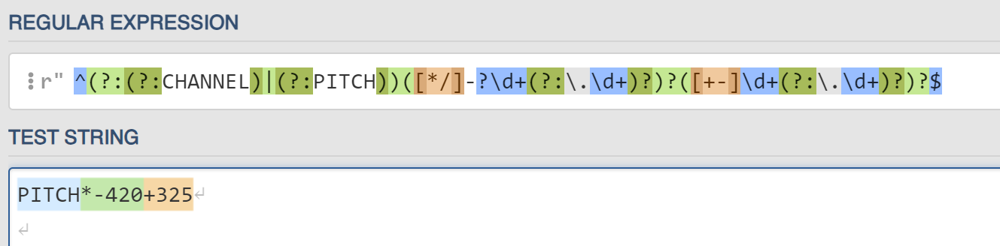

This is an example that does not match, and is thus invalid syntax:

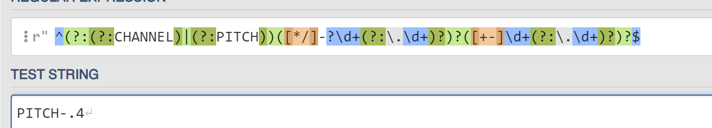

If it doesn't match, the program won't interpret it.
Anything that doesn't match, the program will just
use that as the literal value for v1/v2.

If you really need to do something like `(PITCH+a)*b`,
use `PITCH*b+(a*b)`, evaluating `(a*b)`.

AND IF YOU ARE USING NOTE COLORS FOR CHANNELS ENABLE THIS:

**REMEMBER TO ENABLE THIS FOR __EACH__ MIDI OUT**


### Note Types

In some cases, you want control over the note types. This is what I'm referring to:

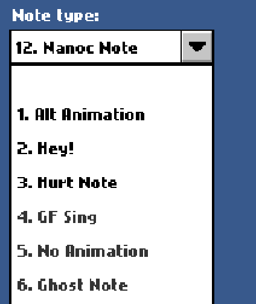

**NOTE: THE NUMBERING NEXT TO THE NOTE TYPE IS IRRELEVANT, IGNORE THEM**. The name of each note type is just its name
without the numbering (e.g. `Alt Animation`, `GF Sing`)

And this is how setting a note type would appear in the chart editor:

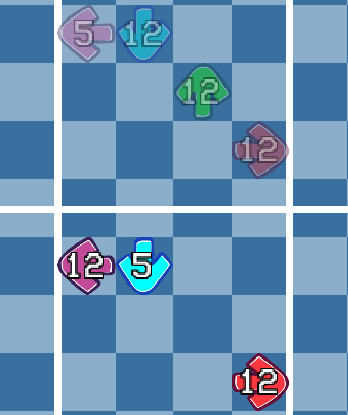

For this program, you can specify the note types here:

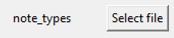

Which ends up being a text file. It is a text file with 16 lines maximum, where each line corresponds to what you want
the note type. Blanks mean regular notes and a note type will not be attached to them. Here is an example of that file.
**You may add comments to these files using `//` (anything `//` and after will be removed by the program), and we strip
leading and trailing whitespace on each line after comments are removed.**

Here is an example of this file:

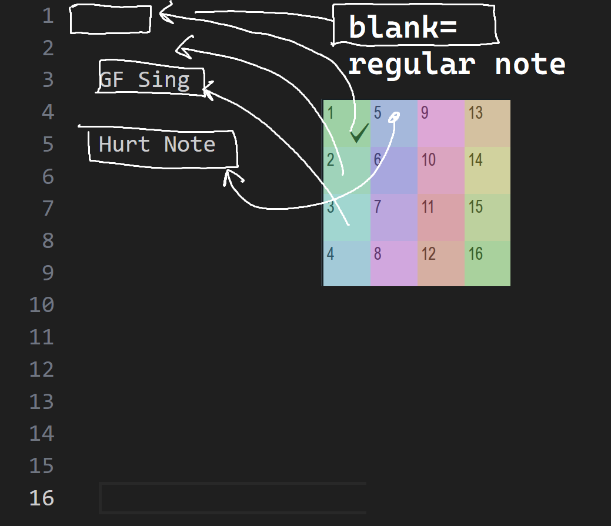

Here's what this file says in this screenshot:

- Notes given color no. 3 in FL Studio will be `GF Sing` notes
- Notes given color no. 5 in FL Studio will be `Hurt Note` notes

Tip: In FL, `ALT+C` changes all selected note colors to the current color you have on the top left of the piano roll. `SHIFT+C` selects all notes with the current color you have on the top left of the piano roll.

If you are editing this in notepad and not Visual Studio Code or Notepad++, you need to count the line numbers yourself.
Note that VsCode counts line numbers from 1, hence why they seem to map exactly to FL Studio channels.

Beyond line 16, the program ignores. If this document is less than 16 lines, the program treats the remaining lines up
to 16 as blanks.

**REMEMBER TO ENABLE THIS FOR __EACH__ MIDI OUT**


## Running this with Python

For developers only, or those who know how to code (aka everyone who has made a script). If you know Lua well enough, you *should* be able to understand Python just by looking at it. Or for anyone who does not want to use the UI to run this.

### Cloning this repo and setting up

*Windows users use `py`, macOS and Linux users use `python3` instead.*

- Clone this repository
- Have Python installed, any version above 3.9
- `cd` to the folder of this repository
- Run `py -m pip install -r requirements.txt`
- Look at ``run_no_ui.py``, set up your files, and run it using `py run_no_ui.py` or run it with the buttons of your IDE. Who even uses this without opening it in VSCode. Or, for those who want to use the command line and create a bunch of batch or shell files, take a look at `run_cmdline.py` (or try `py run_cmdline.py -h`).


## In case of bugs

Probably run the executable in a terminal session since the terminal will persist when the executable stops. If you just
click on the executable, the terminal window will close if the program stops.